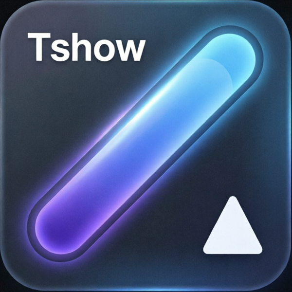
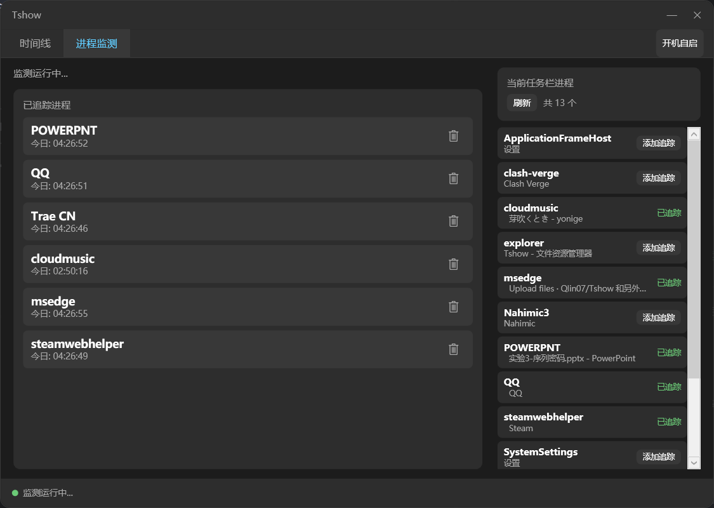
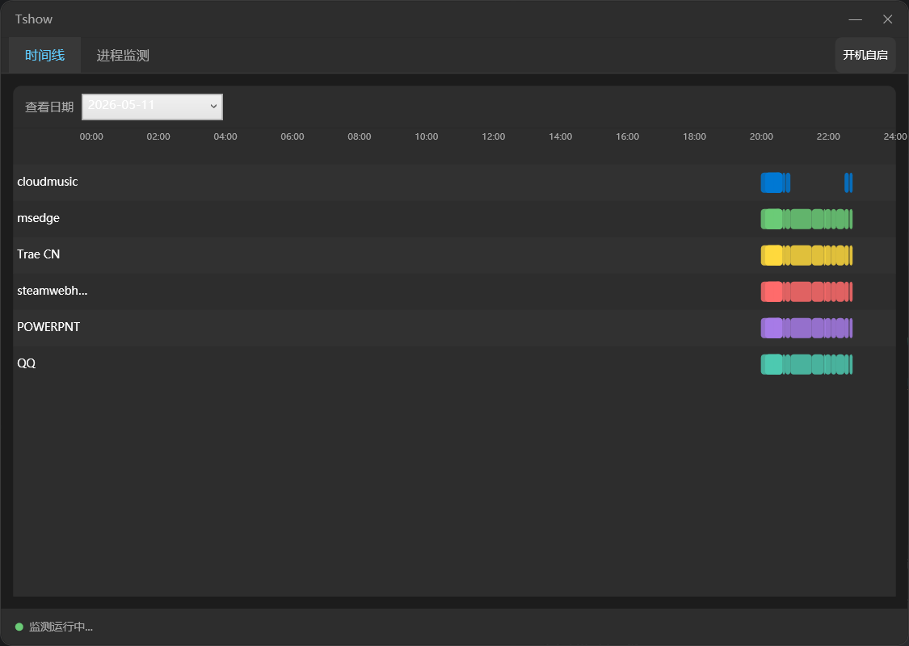

# Tshow

> **T**askbar **S**oftware Usage Time Tracker — 一款轻量的 Windows 软件使用时长监测工具




---

## ✨ 功能

- **后台监测** — 打开软件即自动监测，最小化到任务栏或系统托盘，不干扰正常工作
- **智能检测** — 自动识别任务栏上的应用进程，避免被 Chrome 多标签页等场景干扰
- **使用时长统计** — 精确记录每个软件的开机、关闭时间，按进程名聚合计时
- **可视化时间线** — 甘特图样式展示一天的软件使用时段，不同进程不同颜色
- **历史记录浏览** — 下拉菜单切换任意有记录的日期，查看当天的使用详情
- **自定义追踪** — 自由添加/移除需要监测的进程，只关注你想看的软件
- **开机自启动** — 一键开启，随系统启动后台静默运行
- **极低资源占用** — 单进程运行，内存 < 50MB，CPU < 0.1%

---

## 📸 截图

| 进程监测 | 时间线 |
|:---:|:---:|
|  |  |

---

## 🚀 快速开始

### 运行

下载最新 [Release](https://github.com/yourname/Tshow/releases) 中的 `Tshow.exe`，双击运行即可。**无需安装任何依赖**。

### 开发

```powershell
# 1. 安装 .NET 9 SDK
winget install Microsoft.DotNet.SDK.9

# 2. 克隆项目
git clone https://github.com/Qlin07/Tshow.git
cd Tshow

# 3. 运行
dotnet run

# 4. 发布（生成单 exe）
dotnet publish -c Release -r win-x64 -o ./publish
```

---

## 🛠 技术栈

| 层级 | 技术 |
|------|------|
| 语言 | C# 13 |
| 运行时 | .NET 9（Self-Contained 单文件发布） |
| UI | WPF + Fluent Design |
| MVVM | CommunityToolkit.Mvvm |
| 系统托盘 | Hardcodet.NotifyIcon.Wpf |
| 本地存储 | SQLite（Entity Framework Core） |
| 进程检测 | Win32 P/Invoke（`EnumWindows` / `GetWindowThreadProcessId`） |
| 打包 | `dotnet publish --self-contained` → 单个 .exe |

---

## 📁 项目结构

```
Tshow/
├── Tshow.csproj
├── App.xaml / App.xaml.cs          # 应用入口、单例检测、托盘初始化
├── MainWindow.xaml                 # 主窗口 UI（双页签：进程监测 + 时间线）
├── MainWindow.xaml.cs              # 窗口逻辑、时间线绘制
├── Native/
│   └── Win32Interop.cs             # P/Invoke 封装（任务栏窗口枚举）
├── Models/
│   ├── TrackedProcess.cs           # 追踪进程实体
│   └── UsageSession.cs             # 使用时长记录实体
├── Data/
│   └── AppDbContext.cs             # EF Core DbContext + 日期查询
├── Services/
│   ├── ProcessMonitorService.cs    # 10s 轮询 + 会话管理 + 时长计算
│   └── StartupService.cs           # 注册表开机自启管理
└── ViewModels/
    └── MainViewModel.cs            # MVVM ViewModel（命令、数据绑定、时间线数据）
```

---

## 📦 发布流程

```powershell
dotnet publish -c Release -r win-x64 -o ./publish
```

产物：`publish/Tshow.exe`（约 80MB，已经包含 .NET 运行时和所有依赖，Win10 2004+ / Win11 裸系统可直接运行）。

> **为什么不用 Trimmed？** WPF 不支持 `PublishTrimmed`，因为 XAML 反射依赖完整的类型信息，裁剪后会丢失组件。

---

## 🔧 使用说明

### 第一次使用

1. 启动 `Tshow.exe`，默认进入「进程监测」页
2. 在右侧「当前任务栏进程」中，点击想追踪的软件旁的 **「添加追踪」**
3. 监测自动开始，每 10 秒检测一次进程启停

### 查看使用时长

- 「进程监测」页 — 已追踪进程列表中显示今日累计时长（每秒刷新）
- 「时间线」页 — 甘特图展示所选日期的使用时段，下拉菜单切换历史日期

### 开机自启动

点「开机自启」按钮即可。原理是将快捷方式写入注册表：
```
HKCU\Software\Microsoft\Windows\CurrentVersion\Run\Tshow
```

---

## 📄 许可证

[MIT License](LICENSE)
